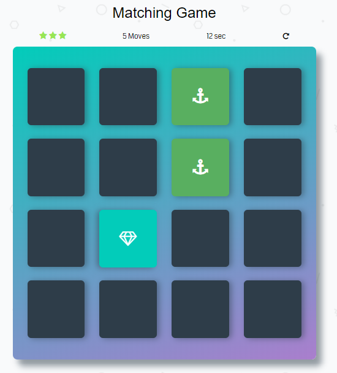

# Memory Game Project

How much can you  remember?

## about game

Hi there! this is a small project programmed using java script  

##How you can play Memory Game
you just need to download it from github by normal downloading or cloning  
and click on index.html file and it will run on your default browser.  

### Dependencies:
* [Font Awesome](https://fontawesome.com/).
* [Google Fonts](https://fonts.google.com/). 

## Table of Contents

* [Contributing](#contributing)

## Contributing

This repository is the starter code for _all_ Udacity students. > 
 Therefore, we most likely will not accept pull requests.  >

For details, check out [CONTRIBUTING.md](CONTRIBUTING.md).

## For More 
see this videos 
<a href="https://www.youtube.com/user/Udacity">Youtube</a>

